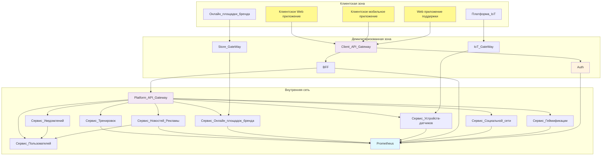

---
## 13. Базовая архитектура 

*Базовая архитектура с учётом ограничений бизнес-требований, НФТ, выбранной архитектуры, адресация атрибутов качества.*

Ограничения: MVP в рамках одного облака, страны.

### *1. Компоненты*
1. Приложения

1.1 Мобильное приложение для клиентов

- iOS;

- Android;

1.2 Web приложение для клиентов

- MS Edge;
- Chrome;
- Yandex;

1.3 Web приложение для администрирования платформы

2. BFF 

2.1 Rest Api для Web клиента;

2.2 Rest Api для мобилок;

2.3 Rest Api для Web админа;

3. Бизнесовые микросервисы платформы

3.1 Пользователей  - управление учетками пользователей, их профилями;

3.2 Тренировок - хранение тренировок пользователей, сравнительный анализ своих тренировок;

3.3 Социальной сети - возможность добавлять друзей, общаться с другими пользователями;

3.4 Геймификации - управление баллами, наградами за достижения, которые простимулируют пользователей на активности на платформе;

3.5 Новостей и Рекламы - управление новостной лентой, статьями, рекламными акциями бренда - используются настройки видимости, интересы, предоставленные пользователем;

3.6 Устройств-датчиков  - управление настройкой интеграционных каналов с Google Fit, Apple HealthKit, которые могут передать данные о тренировках пользователя (шаги, пульс, расстояние, активность);

3.7 Онлайн площадок бренда  - интеграция с приоритетными магазинами по переходу в них по клику на рекламу бренда в рамках одной страны;

3.8  Нотификации - минимальный функционала отправки уведомлений пользователям для авторизации в системе по смс, почтой - используются настройки и данные, предоставленные пользователем;

4. Сервисные микросервисы платформы

4.1 Авторизации и аутентификации (Idp) - обеспечение проверки пользователей и предоставлене им прав на платформе, нагрузка до 100 000 пользователей;

4.2 Gateways - маршрутизация запросов для безопасности между слоями платформы;

4.3 Registries  - сервис для корректного подключения микросервисов в сети;

4.4 Broker Kafka - для надежной интеграции между сервисами данными;

4.5 Prometheus  - мониториг платформы - на начальном этапе достаточно встроенного дашборда.

### *2. Верхеуровневая схема*

Верхнеуровнево приведено взаимодействие компонент

